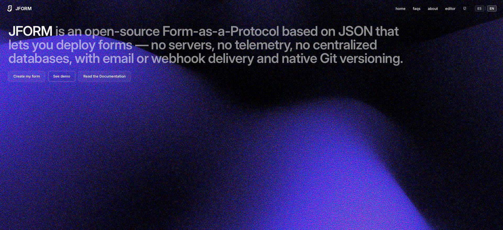

	
	<h1>JFORM</h1>

 **An open-source Form-as-a-Protocol based on JSON that lets you deploy forms**

	

    <a href="https://jform.livrasand.com/">Website</a>
    -
    <a href="./DOCS.md">Documentation</a>
    -
     <a href="https://jform.livrasand.com/privacy"><strong>Read the privacy policy »</strong></a>

 

JFORM is an open-source JSON-based Form-as-a-Protocol, designed under a "Privacy-First" and "Developer-First" philosophy, eliminating the need for centralized databases or opaque third-party services. JFORM is a lightweight engine that lives in the browser and uses the GitHub repository as a configuration "database". JFORM is for those who want to "deploy a solution" instantly, without servers, while maintaining total sovereignty over their data.

- **Decentralization:** Forms are defined using configuration files in `.jform` format (essentially JSON) hosted directly in the user's repository.
- **Zero-Telemetry:** The rendering engine (`jform.vercel.app`) runs entirely in the user's browser (Client-Side). No trackers, no invasive cookies, no logs on intermediate servers.
- **Destination Flexibility (Transport):** The user decides where their data goes. JFORM is not a store, it's a bridge:
  - **Via Email:** Data is processed in memory and sent to a configured email.
  - **Via Webhook:** Data is sent directly to the user's own server or custom API.

- **Git-Native:** Since `.jform` files live in a repository, versioning, auditing, and collaboration (via Pull Requests) are native.

### Why does it exist?

It was born from a personal need, wanting to solve the problem for developers who need to collect information (like sponsor data or a contact form) but refuse to use tools that compromise privacy or require managing heavy server infrastructure.

In short, **JFORM is the "lens" that allows visualizing and sending data in a secure, fast, and private way**, without the tool creator (you) ever having to manage a single piece of end-user data. By definition, it is **infrastructure as code applied to data collection.**

## 👋 Contribution
Feel free to create issues and pull requests if you want!

Please keep up with the code style and discuss new features beforehand with the project owner.

 
 

	<a href="https://jform.livrasand.com/" target="_blank">
		<picture>
			<source media="(prefers-color-scheme: dark)" srcset="./public/jform-logo.svg">
			
		</picture>
	</a>

